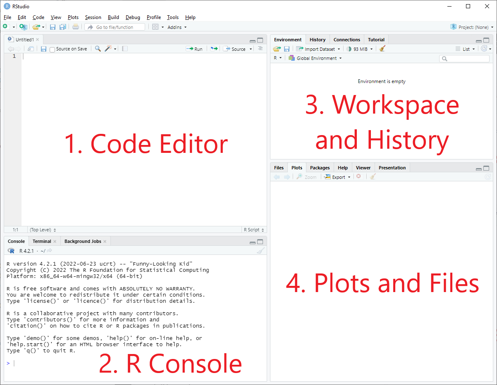
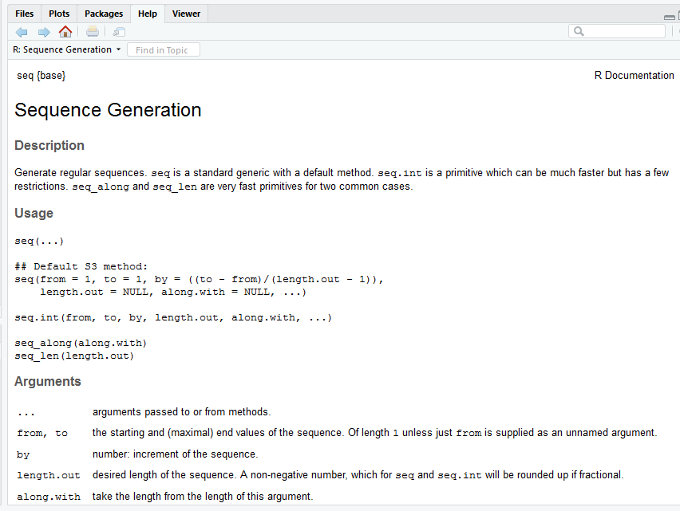

```{r setup, include=FALSE}
knitr::opts_chunk$set(echo = TRUE)
knitr::opts_chunk$set(comment = NA)  # remove the double ## for output
```

<iframe width="560" height="315" src="https://www.youtube.com/embed/_Qn2zL5-qOg" title="YouTube video player" frameborder="0" allow="accelerometer; autoplay; clipboard-write; encrypted-media; gyroscope; picture-in-picture" allowfullscreen data-external="1"></iframe>

During the course, we will work often in RStudio. In this computer module, you will install RStudio and learn about the basics of R.

1. Install and work in RStudio 
2. R calculations and assignments
+ 2.1 Simple calculations
+ 2.2 Assigning a value to an object

3. Different data types (logical, numeric and characters)
+ 3.1 Logical data
+ 3.2 Numeric data
+ 3.3 Character data

4. Vectors
+ 4.1 Vectors using a colon
+ 4.2 Vectors using functions seq() and rep()
+ 4.3 Vectors using rnorm() and runif()
+ 4.4 Character vectors

5. Matrices
+ 5.1 Creating matrices

6. Lists
+ 6.1 Creating lists

7. Data frames
+ 7.1 Creating data frames

8. Factors
+ 8.1 Creating factors

## 1. Install and work in RStudio
You should download R via the [r-project website](https://lib.ugent.be/CRAN/) and RStudio via [rstudio.com](https://rstudio.com/products/rstudio/download/).

1. Go to [https://lib.ugent.be/CRAN/](https://lib.ugent.be/CRAN/) to download R
2. Select your operating system
  - Windows: choose 'base', and download and install R
  - MacOS: download the most recent package
  - Linux: choose your distribution and follow the instructions
3. After installing R, you can install RStudio
4. Go to [rstudio.com](https://rstudio.com/products/rstudio/download/)
5. Download and install the free version (open source edition) of RStudio Desktop for your OS
  - When starting RStudio for the first time, it might ask where you installed R (in step 2)

Note that R also comes with an application called RGui, but we will not use this during the course. We will only use RStudio. 

Throughout this and future COOs, we assume you work on Windows. We will demonstrate the use of keyboard shortcuts, like pressing <kbd>Ctrl</kbd>+<kbd>Enter</kbd> to execute a script. If you use Mac, keyboard shortcuts can be different. In this specific case, you should use <kbd>Cmd</kbd>+<kbd>Return</kbd>. A list of all keyboard shortcuts for all operating systems can be found in RStudio under [Tools &rarr; Keyboard Shortcuts Help](https://support.rstudio.com/hc/en-us/articles/200711853-Keyboard-Shortcuts).

### RStudio contains 4 panels:

 

1. The **code editor** in which you write your script. You can also show your tables from the working environment here. This panel will only appear when you have created a new file. When you have opened RStudio, the first thing you can do is start a new script by clicking File &rarr; New File &rarr; R Script. 
2. The **R console** in which your script is executed and where the results are shown.
3. **Workspace and history** contain the variables and objects you have created during this tutorial.
4. In the **plots and files** panel, you can find 'files', 'plots', 'list of packages', 'help', 'viewer', and 'presentation'. 

To find help, you can click 'help' and search for a certain topic. Alternatively, you can type on the R Console a questionmark and the name of the function, e.g.: `?read.table`. In the 'help' section you can search specific questions, which will direct you to an information page. If this does not satisfy what you were looking for, it is encouraged to search the internet, ask a fellow student, or a teaching assistant (in that order).

This manual shows step by step what is expected of you to write in your script. You can copy-paste it, but it is better to write it yourself. You will see why this is so important in following tutorials in which we will write more complex scripts. Slight mistakes alter how your script works and it may not give the output you want. When you have written a script, you can press run or press <kbd>Ctrl</kbd>+<kbd>Enter</kbd>. The script is executed in the R console and R thus returns your script. 

---

R code is executed in the Console. The blue greater-than-sign ($\color{blue}{>}$) on the very last line of the console is a so-called command prompt and it indicates that R is ready to receive commands. If you enter an incomplete line of code, you instead get a blue plus sign ($\color{blue}{+}$) prompt on the next line. This means R is expecting you to enter additional information to finish the incomplete code. You can stop this by clicking in the Console panel and pressing  <kbd>Esc</kbd>.

---


## 2. R calculations and assignments 
<iframe width="560" height="315" src="https://www.youtube.com/embed/QjBKGJxrkHw" frameborder="0" allow="accelerometer; autoplay; encrypted-media; gyroscope; picture-in-picture" allowfullscreen data-external="1"></iframe>

Below starts a tutorial that teaches you all the basics you need to know to understand how RStudio works. From now on, everything in the grey area is what is expected of you to write in your own script. The line underneath starting with `[1]` will give you the expected answer. If you failed to provide the same answer, try to find what went wrong, google your problem or ask any of us for help. Excercises are displayed in **bold**.

### 2.1 Simple calculations
We will start by practicing some more simple calculations below. **Type the following in the console (the lower left panel):**
```{r}
8 - 4
```
```{r}
9 / 3 
```
```{r}
9 : 3
```
The `-`, `/`, and `:` symbols are examples of operators. The operator `:` does not give the same outcome as the `/` operator. In RStudio the [Arithmetic Operators](https://www.rdocumentation.org/packages/base/versions/3.6.2/topics/Arithmetic) (like `/` and `+`) perform arithmetic on numbers or lists. The [Colon Operator](https://www.rdocumentation.org/packages/base/versions/3.6.2/topics/Colon) returns a closed interval, in this example all the numbers between and including 9 and 3. 

A multiplication in RStudio is an `*` operator.
```{r}
4 * 4
```

**1. Now multiply 5 times 8**  
  
Some other calculations:
```{r}
7 ^ 2
```
```{r}
(10 + 5)  * 3 #everything within the parentheses will be executed first
```
In R you can add notes by using the `#` and R will ignore this, but this could be useful for yourself to make some notes on parts where you did something wrong or to mark the beginning of a new part. It is very important to structure your script like this, because it helps you understand your scripts in the future and helps others to use and adapt your scripts as well.
`#this is just a note and R will ignore it`

### 2.2 Assigning a value to an object
**2. What happens if you type the following in the code editor (upper left panel):** 

`1 + 2` and press <kbd>Enter</kbd>.
  
**3. What happens if you type:**  

`1 + 2` and then press <kbd>Ctrl</kbd>+<kbd>Enter</kbd> 

The outcome of your calculation will only appear in the R console if you run it. Now that we have covered some simple calculations, we can assign values to objects. This can be done using a left arrow operator: `<-` (a less-than character < followed by a minus character -). An object is simply the digital storage unit that stores a value. There are three ways to create an object, which you can try out below.
*From now on no answers will be shown so therefore you have to write them down and correct them later on.*

```{r eval=FALSE} 
a <- 3 #If you run this 'a <- 3' will appear in the R console. The object (variable) 'a' now stores the value '3'. If you then type 'a' in your script and run it your value will appear
a
```

The object with value '3' is now stored. The variable 'a' functions as a reference to this object. 

Note that you can also use an equal sign (=) or a right arrow (->), which you might encounter in code written by others and looks like this:

```{r eval=FALSE} 
a = 3
a
```

```{r eval=FALSE}
3 -> a #the arrow always points to the variable to store it properly
a
```
It is very important to be consistent in the operator you use; choose one. For this course we will always use `<-`.  
You can see all of the objects you created and stored, in the *Workspace and history* panel, under the *Environment* tab.

We can also do simple calculations with our newly formed variables:
```{r eval=FALSE} 
a - 2
```
```{r eval=FALSE} 
a * 16
```
```{r eval=FALSE} 
a <- 8
a
```
Note, that it is possible to overwrite your variables. You can now see in your upper right panel that your value for 'a' has changed from '3' to '8'. It is thus better to store different values under different objects, so you can use both '3' and '8' with a unique variable (for example 'a' and 'b').  
```{r eval=FALSE}  
b <- 6 + 12
b
```
**4. What do you think will be the answer to the following?**  
```{r eval=FALSE} 
a + b
```

## 3 Different data types
<iframe width="560" height="315" src="https://www.youtube.com/embed/6el7mHX1_Ks" frameborder="0" allow="accelerometer; autoplay; encrypted-media; gyroscope; picture-in-picture" allowfullscreen data-external="1"></iframe>

There are different types of data, the most basic types are depicted in the table below. 

Data type|Literal
---------|----------
Logical  |`TRUE` or `FALSE`
Numeric  |`1`, `2`, `3.5`, `-6`, `1.2e3`
Character|`"Name"`, `'Word'`

To see what kind of data type an object in R is, you can use the command `class()`. So, for example, if you run `class(TRUE)`, it will return `[1] "logical"`.

### 3.1 Logical data
Logical data only has one of two possible values, often depicted as 'TRUE' or 'FALSE' (or '1' and '0'). The logical data type tells you whether something is true or not. For example: you can ask R whether one value is greater than another value. When this is true, R will return 'TRUE'. To make different comparisons, you can use the following relational and logical operators:

Operator   | Description
-----------|-----------------------
`<`        | Less than
`>`        | Greater than
`<=`	     | Less than or equal to
`>=`	     | Greater than or equal to
`==`	     | Equal to
`!=`	     | Not equal to
`&`, `&&`  | And
`|`, `||`  | Or

The comparison operators (top six rows) are called the [Relational Operators](https://www.rdocumentation.org/packages/base/versions/3.6.2/topics/Comparison). The operators 'and' and 'or' belong to the [Logical Operators](https://www.rdocumentation.org/packages/base/versions/3.6.2/topics/Logic). 

The logic operators come in a shorter form (`&`, `|`) and a longer form (`&&`, `||`). If you are using lists of data (e.g. a vector) in logic comparisons, you must know that there are important differences between them that can be found in the documentation. When in doubt, prefer the longer form. There are two additional logic operators: `!` is logical negation (`!FALSE == TRUE`) and `xor(x, y)` for the exclusive or (only x or y is true, but not both).

**Try the following statements:**
```{r eval=FALSE} 
1 > 2 #This means that you want to check whether 1 is greater than (>) 2, which is not the case and will return as FALSE.
```
```{r eval=FALSE} 
2 > 1 #This means that you want to check whether 2 is greater than (>) 1, which is correct.
```
```{r eval=FALSE} 
1 < 2 #This means that you want to check whether 1 is smaller than (<) 2, which is correct.
```
```{r eval=FALSE} 
1 <= 2 #This means that you want to check whether 1 is smaller than or equal to 2, which is correct.
```
```{r eval=FALSE} 
2 <= 2 #This returns as TRUE because '2' is equal to '2'.
```
```{r eval=FALSE} 
2 >= 3 #This means that you want to check whether 2 is greater than or equal to 3, which is incorrect because 2 is smaller than 3.
```

We can then ask R the same questions as before but now using a predefined variable 'x'.
```{r eval=FALSE} 
x <- 5
x > 4
```
Because 'x' now stands for '5' the question is whether '5' is greater than '4' which is correct, and R will therefore return TRUE. 

To check whether x is exactly 5, you can use:
```{r eval=FALSE} 
x == 5
```
While `x = 5` is a command to assign a value to a variable, `x == 5` is a command to compare the two objects. 

**5. What do you expect to return when you use the following command?**
```{r eval=FALSE} 
x == 4
```

We can also do the opposite and ask R if 'x' is not equal to '4' with !=.
```{r eval=FALSE} 
x != 4
```
```{r eval=FALSE} 
x != 5
```

It is very important to place spaces between the objects and operators since `x<-5` can mean that you want to assign '5' to 'x' but if you do not space it properly, it says that 'x' is smaller than '-5':
```{r eval=FALSE} 
x < -5
```

### 3.2 Numeric data
Examples of numeric data include actual numbers such as 1, 2, 3 and 3.5. If you execute `class(3.5)` R will return `[1] "numeric"`. The [class function](https://www.rdocumentation.org/packages/base/versions/3.6.2/topics/class) will tell you the datatype of your object. Notice here that you need to be very careful with your writing, if you commanded R to return `class(3,5)`, it will return an error, because you ask to return the class of both '3' and '5', while it can only assess the class of one object at a time. If you use decimals you must indicate that with a period and not with a comma. R uses a period as decimal separator.
A subclass of numeric data is the data type 'integer'. Integers are "whole" numbers, for example 1, 163, and -15. Fractions, such as 1/2, 9.13, and the square root of 2, are of the type numeric, but not of integer.

You may encounter somewhat more exotic number formatting in real life code. For completeness, we are showing them here as well. First the [scientific notation](https://en.wikipedia.org/wiki/Scientific_notation), in which you would write 1200 as 1.2&times;10<sup>3</sup> and in R this is:

```{r}
1.2e3
```

### 3.3 Character data
The data type 'character' is used for text. An example of character data would be your name or a variable X. Character data is presented between quotes, for example "Thomas". `class("Thomas")` and `class('Thomas')` will return `[1]"character"`. If you forget the quotation marks, R interprets `Thomas` as an object. Since you didn't create an object called Thomas, R will return an error messages for `class(Thomas)`. You can see that the color of the text in your script changes according to its class. So, you will notice when you do start a character string (with `"`), but forget to close it with another quotation mark.

Note that you have to use the plain quotations marks `'` or `"`. The nice quotation marks (&lsquo; &rsquo; or &ldquo; &rdquo;) that Word or other editors use will cause an error in R.

## 4 Vectors
<iframe width="560" height="315" src="https://www.youtube.com/embed/jQJL_X8WEn4" frameborder="0" allow="accelerometer; autoplay; encrypted-media; gyroscope; picture-in-picture" allowfullscreen data-external="1"></iframe>

A vector is a sequence of the same data type. To make a vector, you can use the logic, numeric or character data. The vector starts with c() followed by the data sequence. The [c() function](https://www.rdocumentation.org/packages/base/versions/3.6.2/topics/c) is used to combine different elements. You separate the elements in a vector with commas.
```{r eval=FALSE} 
c(1, 2, 3, 4)
```

Now you created a vector but when you want to continue with these numbers, R cannot recall them. Therefore, we must assign this vector to an object.
```{r eval=FALSE} 
vector1 <- c(1, 2, 3, 4)
vector1
```

Now you can use `vector1` to use the numeric data from your vector.
```{r eval=FALSE} 
vector2 <- c(2, 3, 4, 5)
vector2
```

You can do some simple calculations with two different vectors:
```{r eval=FALSE} 
vector1 + vector2 
```
Or
```{r eval=FALSE} 
c(1, 2, 3, 4) + c(2, 3, 4, 5)
```
You will notice that the first element of the first vector will be added to the first element of the second vector (1+2), the second to the second (2+3), and so on, to return a new vector (3,5,7,9).
You can also apply one type of calculation to every element in the vector:
```{r eval=FALSE} 
vector1 + 3 #adding three to every element in vector1.
```
```{r eval=FALSE} 
vector2 * 2 #multiplying every element in vector2 by two.
```

**6. Write a line of code to substract ```4``` from each element of ```vector1```.**

**7. Write code to divide each element of ```vector2``` by ```5```.**

### 4.1 Vectors using a colon
You can also make vectors with the sequences of integers ("whole" numbers) using the [Colon Operator](https://www.rdocumentation.org/packages/base/versions/3.6.2/topics/Colon) (`:`): 
```{r eval=FALSE} 
vector3 <- 1:10
vector3
```

The colon can be used to display all datapoints between 1 and 10. We do not need to use the c() function to make such a numeric vector. 
```{r eval=FALSE} 
vector4 <- 10:1
vector4
```

**8. Try making a very large vector (e.g. ranging from 13 to 524) and a vector of negative values (e.g. ranging from -20 to -50; or -10 to 8).**

### 4.2 Vectors using functions seq() and rep()
Vectors can also be created using `seq()` (sequence) or `rep()` (repeat) functions. We have already used some simple functions before, for example the `c()` command that we used to create vectors. Each function contains one or multiple arguments. These arguments are stated between the brackets of the function. The [sequence generation function](https://www.rdocumentation.org/packages/base/versions/3.6.2/topics/seq) `seq()` creates a regular sequence:
```{r eval=FALSE} 
seq1 <- seq(from = 1, to = 5, by = 0.5) 
seq1
```
As you can see, seq1 is a vector which starts with 1 and then follows up to 5 with steps of 0.5. 'From', 'to', and 'by' are the so-called arguments of the function. For many functions there is a standard order to arguments in a function, so you can use them without giving the names of the arguments:
```{r eval=FALSE}
seq2 <- seq(1, 5, 0.5)
seq2
```
seq2 is the same as seq1, because it is predefined that the first argument given is 'from', the second is 'to', and the third is 'by'.

If you can't remember which arguments to use in a function, you can use the 'Help' pages in RStudio. You can do this by clicking on 'Help' in the 'Plots and files' panel and search with the search bar, or you can use the command `help(functionname)` or `?functionname`.  An explanation of how to read the 'Help' panel can be found [here](https://robwschlegel.github.io/Intro_R_Workshop/workflow.html#help).
An example:
```{r eval=FALSE}
?seq
```


Another function to create a vector with numerics is the [replicate function](https://www.rdocumentation.org/packages/base/versions/3.6.2/topics/rep): `rep(x = , times = )`, which repeats the argument you provide for 'x' as many times as the integer you provide for 'times':
```{r eval=FALSE} 
rep1 <- rep(1, 4) #This is a command to repeat the value 1 four times
rep1
```
```{r eval=FALSE} 
rep2 <- rep(1:3, 4) #This is a command to repeats the values 1 to 3 four times
rep2
```

### 4.3 Vectors using rnorm() and runif()
Vectors can be also made with random values using the rnorm() and runif() functions. `rnorm()` draws numbers from a [normal distribution](https://www.rdocumentation.org/packages/stats/versions/3.6.2/topics/Normal) with a mean of 0 and a standard deviation of 1. `runif()` draws numbers from a [uniform distribution](https://www.rdocumentation.org/packages/stats/versions/3.6.2/topics/Uniform) in the interval (0, 1). 
```{r eval=FALSE} 
x <- rnorm(3) #This is a command to return 3 values from a normal distribution
x
```
```{r eval=FALSE} 
y <- rnorm(8) 
y
```
```{r eval=FALSE} 
z <- runif(5) #Uniform random variables in the interval (0, 1)
z
```

### 4.4 Character vectors
You can also make a vector with character data as follows:
```{r eval=FALSE} 
Countries <- c("The Netherlands", "Belgium", "France", "Germany")
Countries
```
```{r eval=FALSE} 
Inhabitants <- c(17084719, 11491346, 62814233, 80594017)
Inhabitants
```

If you want to determine the number of elements that are present in a vector/object, you can use the [length(x = ) function](https://www.rdocumentation.org/packages/base/versions/3.6.2/topics/length), in which you use the vector name as the single argument.  
**9. Which command returns the number of values in the 'Inhabitants' vector?** 


## 5. Matrices
<iframe width="560" height="315" src="https://www.youtube.com/embed/vQA1urwadns" frameborder="0" allow="accelerometer; autoplay; encrypted-media; gyroscope; picture-in-picture" allowfullscreen data-external="1"></iframe>

A matrix is like a vector because it is also a collection of data elements, but is displayed in rows and columns and is therefore called two-dimensional. As with a vector, a matrix can only contain one type of data (logical, numeric or character). A matrix can be made using the [`matrix()` function](https://www.rdocumentation.org/packages/base/versions/3.6.2/topics/matrix), a vector with values, and at least one matrix-dimension. In the next example a matrix will be formed from 

* The values 1 to 6; 
* 'nr' indicates the number of rows that we want, in this case 2; 
* 'nc' indicates the number of columns that we want, in this case 3.

### 5.1 Creating matrices

```{r eval=FALSE} 
matrix1 <- matrix(1:6, nr = 2, nc = 3) #A matrix with values 1 to 6 distributed over 2 rows and 3 columns
matrix1
```
```{r eval=FALSE} 
matrix2 <- matrix(1:6, nr = 3, nc = 2) #A matrix with values 1 to 6 now distributed over 3 rows and 2 columns
matrix2
```

You can also create separate vectors and combine the vectors to a matrix using [the functions `rbind()` or `cbind()`](https://www.rdocumentation.org/packages/base/versions/3.6.2/topics/cbind). cbind is short for columnbind in which the vectors you provided are put into columns of a matrix. rbind is short for rowbind and takes the vectors you give it and puts them together in rows of a matrix. 
**Try out this example:**
```{r eval=FALSE} 
a <- c(1, 2, 3) #vector 1
a
```
```{r eval=FALSE} 
b <- c(4, 5, 6) #vector 2
b
```
```{r eval=FALSE} 
c <- c(7, 8, 9) #vector 3
c
```
```{r eval=FALSE} 
B <- rbind(a, b, c) #combining vector 1, 2 and 3 into rows of a new matrix called B. Note that the capital letter 'B' differs from the lower case 'b'. 
B
```
```{r eval=FALSE} 
C <- cbind(a, b, c) #combining vector 1, 2 and 3 into columns of a new matrix called C.
C
```
```{r eval=FALSE} 
cbind(1:2, 1:2) #columns 1 to 2 of values 1 to 2
```
```{r eval=FALSE} 
rbind(1:2, 1:2) #rows 1 to 2 of values 1 to 2
```
**10. Create the following matrix using `cbind()`. Next, create the same matrix with `rbind()`:**
```{r echo=FALSE}
cbind(c(2, 3, 5), c(7, 11, 13))
```
You can also use cbind() and rbind() to add rows and columns to an existing matrix. 

```{r eval=FALSE} 
cbind(b, 7:9) #we now add one extra column with the values 7 to 9
```

## 6.	Lists
<iframe width="560" height="315" src="https://www.youtube.com/embed/9OTxzQfZwHs" frameborder="0" allow="accelerometer; autoplay; encrypted-media; gyroscope; picture-in-picture" allowfullscreen data-external="1"></iframe>

You can use lists to store different data types in one data structure. Lists can contain vectors and matrices but also information such as dates. When you store information in a vector and call the whole vector, R will return everything in that vector in the order you gave it. When you store information in a list and call the whole list, R will return each element separately. 

### 6.1 Creating lists
```{r eval=FALSE} 
a <- c("hello", "how", "are", "you", "?")
a
```

Or using the [list() function](https://www.rdocumentation.org/packages/base/versions/3.6.2/topics/list):
```{r eval=FALSE} 
list1 <- list("hello", "how", "are", "you", "?")
list1
```

## 7. Data frames
A data frame is like a matrix because it also contains rows and columns. A data frame is also like lists because it can store different types of data at once. A data frame is a mix between the two. In a data frame, rows correspond with observations (people for example)  and columns correspond with variables (such as age, name and whether they are in a relationship or not). Each row can contain a different type of data but the data in the columns should be of the same type (age = numeric, name = character, relationship status = logical). To make a data frame we use the [`data.frame()` function](https://www.rdocumentation.org/packages/base/versions/3.6.2/topics/data.frame). Before we make a data frame, we need to make different vectors for each row in our data frame.

### 7.1 Creating data frames
```{r eval=FALSE} 
name <- c("Tom", "Nadia", "Anna", "Inge") 
age <- c(24, 20, 21, 23)
relationship <- c(TRUE, FALSE, TRUE, TRUE) #in a dataset the question yes or no is marked as TRUE or FALSE
people <- data.frame(name, age, relationship) #placing our vectors into a data frame 
people
```

Note that the columns have the names of the vectors (name, age, relationship). We can change these. We can use the `colnames()` function to do so. For example, if we want to change the names because we gave our vectors names without capital letters, we can do this with the following command. *Note that the order in which you change the names matters.* 
```{r eval=FALSE} 
colnames(people) <- c("Name", "Age", "Relationship")
people
```

Within RStudio you can view your data frame by clicking on the dataframe in the upper right panel (Environment). You can also use a command to view the dataframe: 
```{r eval=FALSE} 
View(people) #note that the V is a capital letter
```
.png) 

## 8	Factors
<iframe width="560" height="315" src="https://www.youtube.com/embed/bQCMCYVYvYE" frameborder="0" allow="accelerometer; autoplay; encrypted-media; gyroscope; picture-in-picture" allowfullscreen data-external="1"></iframe>

A [factor](https://www.rdocumentation.org/packages/base/versions/3.6.2/topics/factor) is another way to store data. Factors store so-called categorical variables. A categorical variable can belong to a limited number of categories, and thus belongs to a particular finite group. Examples of categorical variables are countries, gender, and occupation. 
A factor is a data structure that stores categorical data. Factors can be ordered or unordered and are an important class for statistical analysis and for plotting. Once created, factors can only contain a pre-defined set of values, known as levels. By default, R always sorts levels in alphabetical order. Using the example of a survey in which respondents are asked about their blood type, we will illustrate how factors can be used. There are four different blood types: A, AB, B and O. These blood types are called [levels](https://www.rdocumentation.org/packages/base/versions/3.6.2/topics/levels). So, we now have four levels (A=1, AB=2, B=3 and O=4). We can use these when we survey people for their blood types. In this example we surveyed 8 people in which two had blood type A, three had AB, two had B and one had O.

### 8.1 Creating factors
We first create a vector containing the answers of the respondents:
```{r eval=FALSE} 
Bloodtype <- c("A", "AB", "A", "B", "AB", "B", "O", "AB") 
Bloodtype
```

By adding the "quotes", we make Bloodtype a vector with characters. You can confirm that by calling class(Bloodtype).
```{r eval=FALSE} 
class(Bloodtype)
```

We now need to transform this character type data to a factor: 
```{r eval=FALSE} 
Bloodtype <- factor(Bloodtype)
Bloodtype
```
Here we can see that R returns the levels in alphabetical order.

When comparing other values in the survey between people with the different blood types, the factor makes it easy to split the respondents based on their blood type. You could for example compare the mean age of people with bloodtype "A" with the mean age of all respondents.

## Summary
In this COO, you have learned to work in RStudio, to perform simple calculations and you have been introduced to the most important data types of R.
The questions below might help you to keep the overview for the next COOs: 

1. How do you assign a variable? 
2. What are logical, numeric, character and integer data types? 
3. Which command can you use to check the data type of a variable? 
5. What are vectors, matrices, lists, data frames and factors? And what types of data can you store in them? 
4. How do you create a vector? How do you create a regular sequence? How do you create a sequence of repeats? 
5. How do you create a matrix? 
6. How do you create a list? 
7. How do you create a dataframe? How do you change the column names of a data frame? 
8. How do you create a factor?   

### Additional exercises

**A1. Recreate this next vector and store it in a variable ```species```**
```{r, echo=FALSE}
c("human", "fruit fly", "rat", "thale cress")
```

**A2. What type is the variable ```species```? What function can you use to determine the type of an object? Use this function to check your answer.**

**A3. Can you recreate this next vector using vector functions and operations, and store it in a variable ```numbers```?**

```{r, echo=FALSE}
5:8 * 100 - 1
```

**A4. Can you recreate this next data.frame? What are the types of each column? Can you make sure the ```kingdom``` column is a factor?**

```{r, echo=FALSE}
species <- c("human", "fruit fly", "rat", "thale cress")
numbers <- 5:8 * 100 - 1
numbers <- 99 + 4:7 * 100          # Alternative
numbers <- seq(499, 799, by = 100) # Alternative
data.frame(species, numbers, kingdom = factor(c("Animalia", "Animalia", "Animalia", "Plantae")))
kingdom <- c("Animalia", "Animalia", "Animalia", "Plantae")
kingdom <- factor(kingdom)
final <- data.frame(species, numbers, kingdom)
```

**A5. Rename the three columns to respectively ```type```, ```count```, ```category```.**

```{r, echo=FALSE}
colnames(final) <- c("type", "count", "category")
final 
```
